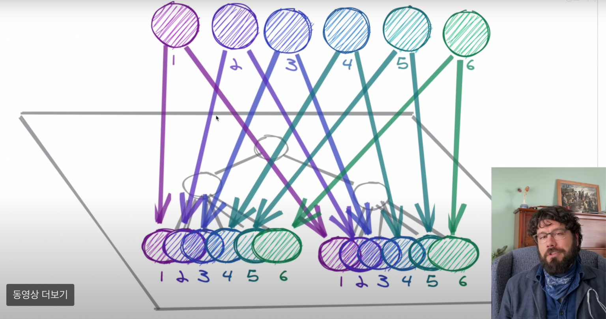

# Redux vs Recoil

React 의 상태 관리 라이브러리로는 아직 Redux 가 압도적인 점유율을 가지고 있다. 시작된지 얼마 되지 않은 Recoil 에 비해 Redux 는 7년이 넘는 역사를 가지고 있어, 익숙함에서 넘을 수 없는 차이를 보인다.

> 2022년 10월 2일 기준 Weekly Download 
> Redux: 8,219K 
> Recoil: 351K

Recoil 이 왜 계속 언급되는지 리덕스와 간단한 비교를 통해 Recoil 의 장점을 알아보려고 한다.

## React 의 Flux 패턴

먼저 React 는 기존 MVC 패턴의 복잡한 데이터 흐름을 단순화하기 위해 Flux 패턴을 이용하고 있다.

기존 MVC 패턴에서는 어떤 데이터가 변경되었을 때, 해당 데이터를 사용하는 모든 곳에서 코드를 작성하고 변경해야하고, 이 과정에서 오류가 발생하거나 다르게 동작하는 등 Side Effect 가 빈번하게 발생한다.

이를 해결하기 위해 Flux 패턴을 적용한 React 에서 데이터는 부모에서 자식 컴포넌트로 단방향으로 흐른다.

## Flux 패턴을 적용한 Redux

Redux 는 React 에서와 같이 Flux 패턴을 적용한 라이브러리이다.

Action 을 생성(type, payload)하여 이를 Dispatcher 에게 전달한다. :arrow_right: Dispatcher 는 모든 Action 을 전달받아 Store 에 전달한다. :arrow_right: Store 는 State 를 가지고 있고, State 를 변경해준다. :arrow_right: Store 에서 State 변경 시, change 이벤트가 발생하면서 View 에게 State 가 변경되었다는 것을 알려준다. 이때 View 에서 사용하는 State 에 업데이트가 일어나 리렌더링된다.

## Recoil

Recoil 은 상태 관리 라이브러리의 하나로, Atomic 모델 기반(Atom 이라는 작은 상태 단위로 관리하고 Atom 을 결합하여 데이터 가공)이라는 점이 다르다.

**Recoil 이 언급되는 이유**

1. **Redux의 복잡한 코드**: Redux 를 사용하기 위해 action, dispatcher, reducer, store 등 구현해야할 기본 코드들이 많다.
2. **간단한 Recoil 의 개념**: Recoil 에서 State 를 관리하는 방법은 Redux 의 데이터 흐름을 익히는 것보다 간단하게 배울 수 있다.
3. **쉽게 사용하는 비동기 로직**: Redux 에서 비동기를 활용하기 위해서는 Middleware 를 활용해야한다. 비동기 통신을 한다면 통신이 성공/실패 하는지에 따라 구분하여 State 를 관리해야 하고, 이를 쉽게 하기 위해서는 Redux-thunk, 혹은 Redux-saga 와 같은 Middleware 가 추가로 필요하다. 하지만 Recoil 에서는 내장된 selector 개념을 활용해 쉽게 비동기 로직을 구현할 수 있다.

### Atom

출처: https://www.youtube.com/watch?v=_ISAA_Jt9kI

Web Application 의 구조 상단에 Atom 이 비눗방울처럼 둥둥 떠다니고 있다고 추상화 할 수 있다.

Recoil 은 Atom 이라는 상태 단위로 상태를 관리하며 컴포넌트는 이 Atom 을 구독하기만 하면 된다. Atom 을 선언하여 export 해주고, 사용하고 싶은 컴포넌트에서는 useState 를 사용하듯 useRecoilState 함수 하나로 해당 상태를 꺼내서 사용할 수 있다.

또한 상태를 구독한 컴포넌트만 리렌더링 되어 상태 변경으로 인한 불필요한 렌더링이 발생하지 않는다.

### Selector

selector 는 atom 을 활용해 원하는 값을 꺼내 사용할 수 있는 API 이다. selector 는 atom 에서 readonly 한 값만을 원하는 대로 변형하여 리턴받는다.

Recoil 에서는 selector 를 이용하여 비동기 통신을 하게 되며, selector 는 내부적으로 자동으로 캐싱을 해주기 때문에, 한번 비동기 통신을 통해 값이 캐싱되어있다면 매번 같은 비동기 통신을 하지 않고 캐싱된 값을 추척하여 사용해준다.

## Redux vs Recoil

Recoil 은 React 스러우면서도 진입장벽이 높지 않고, 적은 학습 곡선을 갖는데다가 코드량도 훨씬 적다.

하지만 그럼에도 불구하고 DevTools 적용이 아직 되어있지 않고, 사용량이 비교적 적고 역사가 길지 않아 에러핸들링이 비교적 어렵다. 추가적으로 대규모 프로젝트에 적용하기에는 좋은 사례라던가 레퍼런스가 부족하다는 점이 단점이다.